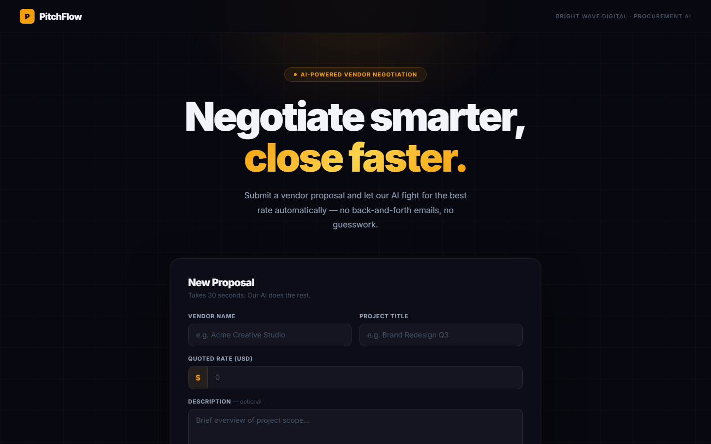
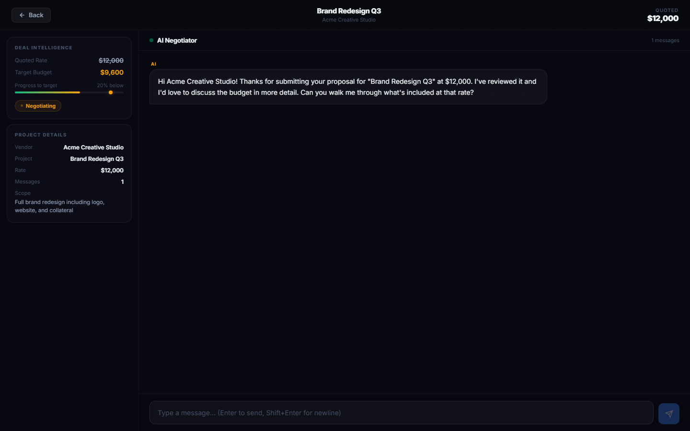
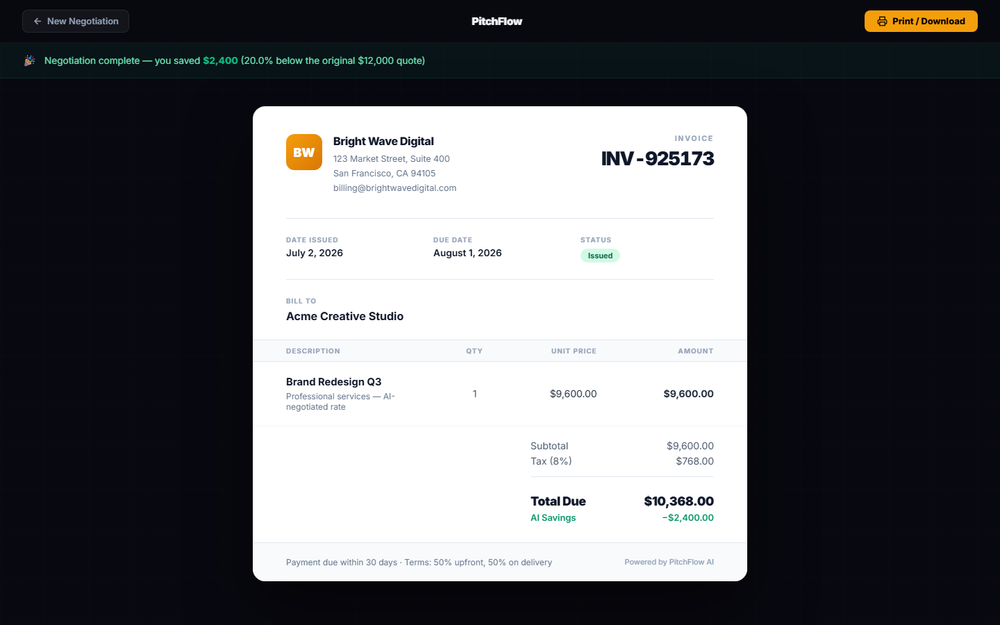

# PitchFlow — AI Vendor Negotiation

PitchFlow is an AI-powered procurement tool that automatically negotiates vendor prices on your behalf. Submit a proposal, chat with the AI negotiator, and receive a professional invoice the moment a deal is confirmed.

Built for **Bright Wave Digital** and any team that negotiates with vendors regularly.

---

## Screenshots

### Home — Command Center
> Submit a new vendor proposal and view your full negotiation history at a glance.



### Pitch — Negotiation Arena
> Real-time AI chat with a live deal intelligence sidebar tracking your target price and savings.



### Invoice — Deal Summary
> Auto-generated invoice with your company branding, savings breakdown, and print support.



---

## Features

- **AI Negotiation Engine** — GPT-4o-mini powered negotiator targets 20% below the vendor's quoted rate
- **Deal Intelligence Sidebar** — Live view of quoted rate, target budget, agreed price, and savings %
- **Negotiation History** — Every closed deal is saved locally with stats (total saved, avg discount)
- **Company Settings** — Set your own company name, address, and email — shown on every invoice
- **Premium Invoice** — Auto-generated on deal confirmation with tax, savings breakdown, and print mode
- **Dark Luxury UI** — Maximalist dark theme with gold accents, glass cards, and animated elements
- **Dockerized** — One command to run both frontend and backend

---

## Tech Stack

| Layer | Technology |
|---|---|
| Frontend | Next.js 14 (App Router), TypeScript, CSS Modules |
| Backend | FastAPI, Python 3.11, Uvicorn |
| AI | LangChain, OpenAI GPT-4o-mini, FAISS vector search |
| Infrastructure | Docker, Docker Compose |

---

## Getting Started

### Prerequisites
- [Docker Desktop](https://www.docker.com/products/docker-desktop/)
- An OpenAI API key

### 1. Clone the repo

```bash
git clone https://github.com/PremKumar-Narla/pitchflow.git
cd pitchflow
```

### 2. Add your API key

Edit the `.env` file in the root:

```env
OPENAI_API_KEY=sk-proj-your-key-here
```

### 3. Run with Docker

```bash
docker-compose up --build
```

| Service | URL |
|---|---|
| Frontend | http://localhost:3001 |
| Backend API | http://localhost:8002 |
| API Docs (Swagger) | http://localhost:8002/docs |

---

## Project Structure

```
pitchflow/
├── backend/                  # FastAPI Python service
│   ├── ai/
│   │   ├── chatbot.py        # LangChain + GPT-4o-mini negotiation logic
│   │   ├── knowledge_base.py # FAISS vector store for company context
│   │   └── prompts.py        # System prompts and negotiation strategy
│   ├── routers/
│   │   ├── chat.py           # POST /api/chat/message
│   │   └── engagement.py     # Invoice + engagement tracking endpoints
│   ├── main.py
│   ├── requirements.txt
│   └── Dockerfile
│
├── frontend/                 # Next.js 14 app
│   ├── src/app/
│   │   ├── page.tsx          # Home — proposal form + deal history
│   │   ├── pitch/page.tsx    # Negotiation arena with AI chat
│   │   └── invoice/page.tsx  # Invoice generation page
│   ├── package.json
│   └── Dockerfile
│
├── docker-compose.yml
├── .env                      # Your secrets (gitignored)
└── .env.example
```

---

## Environment Variables

| Variable | Location | Description |
|---|---|---|
| `OPENAI_API_KEY` | root `.env` | Your OpenAI API key |
| `FRONTEND_URL` | root `.env` | Frontend origin for CORS (default: `http://localhost:3001`) |
| `NEXT_PUBLIC_API_URL` | `frontend/.env.local` | Backend URL used by the browser (default: `http://localhost:8002`) |

---

## How It Works

1. **Submit a proposal** — Enter vendor name, project title, and their quoted rate
2. **AI negotiates** — The AI acts as your procurement rep, targeting 20% below quote (max 10% above target)
3. **Deal confirmed** — When both sides agree, the chat outputs a `DEAL_CONFIRMED` marker
4. **Invoice generated** — An invoice is created with your company details, agreed price, tax, and savings

---

## Adding Screenshots

Take screenshots of the running app and save them to `docs/screenshots/`:

```
docs/screenshots/home.png
docs/screenshots/pitch.png
docs/screenshots/invoice.png
```

They will automatically appear in this README.
